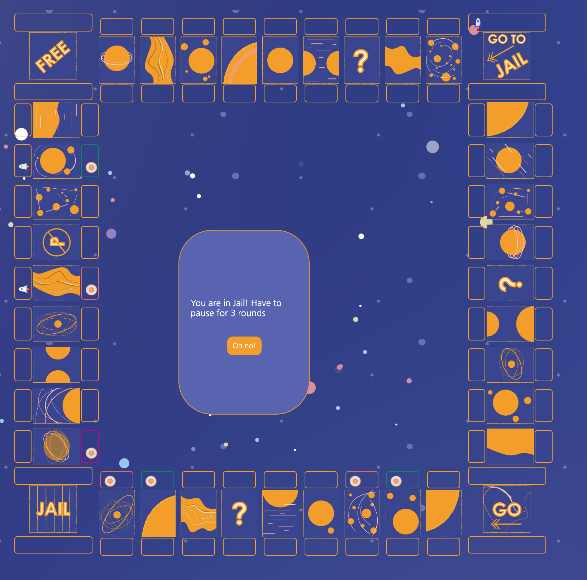

# monopoly-the Space Version 
0.Background: 
    This is year 22000, where technologies allow human to explore the universe freely! As one of the first exploror of the universe, you have the chance to build up Real Estate in space! 

I. To play the game: 
    The game is published at https://jessq1.github.io/monopoly/ 

II. Wirframe 
    1. Initial Prototype: 
    2. Post styling game view: 
       1. 
       2. 

III. Pseudocode: 
    1. Diagram: 
    2. Major functionalities: 
       1. Player moves based on dice roll 
   
       2. depending on Player's location, pop up the following functionalities 
          1. Draw a chance card: 
             1.  
             2.   
          2. Go to jail: 
             1. 
          3. buy land or pay owner rent 
             1. 
             2. 
          4. illegal parking or free parking 
          5. Pass go will recieve 200 
       3. When player's fund reaches 0, the player is out of the game: 
          1. 
       4. When all other players are out of the game. We have a winner! 
          1. 

IV.Technologies Used: 
    1. HTML 
    2. CSS 
    3. JavaScript 
    4. Adobe Illustrator 

V. Nex-Steps: 
    1. CSS for enhanced UIs (icons, graphics) 
    2. Sounds effect for winning 
    3. Mobile version 

VI.References: 
    1. Planet name generator: https://fantasynamegenerators.com/planet_names.php 